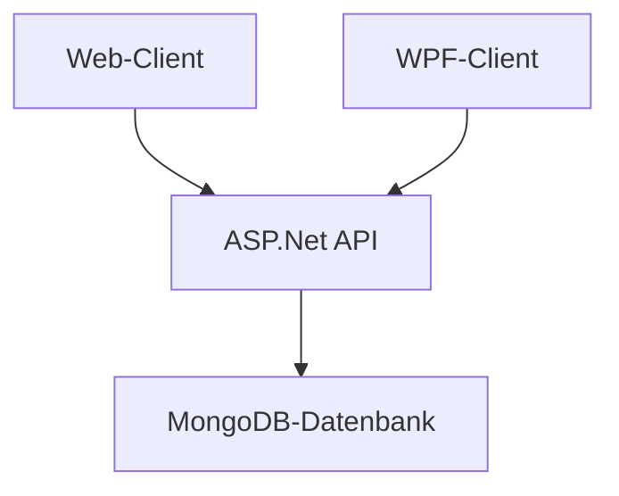
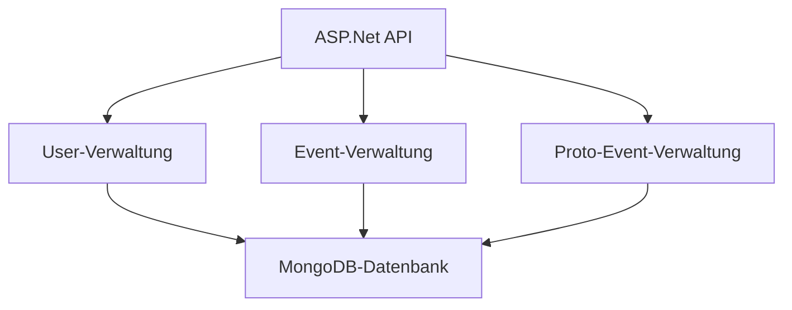

# WeekendPlanner
## Software Architektur
Der WeekendPlanner stellt eine Client-Server Anwendung dar, welche sowohl durch einen auf Vue.js basierendem Web-Client und einem C# WPF Client Zugriff auf die im ASP.Net Backend verwalteten Daten ermöglicht. 

## Beschreibung der Software
Der WeekendPlanner soll Benutzern ein einfache Möglichkeit bieten, sich über verschiedene Veranstaltungen wie Festivals, Bierzelte, Bälle, Partys und vieles mehr zu informieren und somit ihre kommenden Wochenenden zu planen. Die Events können von Usern hinzugefügt und von Admins bearbeitet, gelöscht oder veröffentlicht werden.

## Beschreibung der API

Das Rückgrat dieses Projektes stellt die ASP.Net API sowie die im Hintergrund laufende MongoDB Datenbank dar. Die API besteht grundsätzlich aus 3 Controllern inklusive Services, Schemas und MongoDB Collections sowie sämtlicher Server Middleware für die CORS-Regelung, Session Handling und Health Checks, was nun alles folgend näher beschrieben wird.

### Controller inkl. Services und Modelle
Grundsätzlich setzt sich jeder Zweig der API wie folgt zusammen: 
- Ein Controller in welchem die benötigten Endpoints spezifiziert werden
- Ein Service der die Verbindung zur Datenbank verwaltet und die damit verbundenen Aufgaben übernimmt
- Ein Schema bzw. Modell welches in der Collection gespeichert werden soll

Für dieses Projekt wurden wie bereits erwähnt 3 dieser Zweige implementiert, wobei der Zweig für die User- und für die Event-Verwaltung eine höhere Priorität haben und der dritte eher als Zwischenlager für noch nicht veröffentlichte Events gilt.

Das Schema für die API lautet wie folgt: 
`https://localhost:7002/api/[Controller]/[Endpoint]`

Eine beispielhafte Verwendung der API würde so aussehen: 
`
curl --location 'https://localhost:7002/api/event/allEvents'
`

Im folgenden werden nun sämtliche verfügbaren Endpoints und deren Funktion kurz vorgestellt:

#### User-Verwaltung
##### Get-Endpoints:

`/api/user/allUsers`:
- gibt eine Liste mit allen Usern zurück
- dient mehr zu Testzwecken

`/api/user/oneUser`:
- gibt einen User zurück
- dient mehr zu Testzwecken

`/api/user/checkEmail`:
- gibt einen bool-Wert zurück
- benötigt die E-Mail Adresse als Parameter
- dient zur Kontrolle bei der Registrierung

`/api/user/isAdmin`:
- gibt einen bool-Wert zurück
- braucht keinen Parameter, da mit der SessionId gecheckt wird
- wenn User auch Admin ist wird auch der Zugang auf das Admin-Dashboard genehmigt

`/api/user/myEvents`:
- gibt eine Liste der Events zurück, welche der User erstellt hat
- dient zur Anzeige dieser Events

`/api/user/savedEvents`:
- gibt eine Liste der Events zurück, die der User gespeichert hat
- dient zur Anzeige dieser Events

##### Post-Endpoints:

`/api/user/login`:
- benötigt die E-Mail und das Passwort im Request-Body
- Wenn dies funktioniert hat wird die Session erstellt

`/api/user/createUser`:
- benötigt sämtliche Informationen eines Users im Request-Body
- Erstellt den neuen User und eine Session

`/api/user/addMyEvent`:
- benötigt die gewünschte Event Id als Parameter
- fügt das Event dem User zu seinen erstellten Events hinzu

`/api/user/addSavedEvent`:
- benötigt die gewünschte Event Id als Parameter
- fügt das Event dem User zu seinen gespeicherten Events hinzu

##### Put-Endpoints:

`/api/user/updateUser`:
- benötigt auch einen gesamten neuen User im Request Body
- aktualisiert vorhanden User mit neuen Daten

##### Delete-Endpoints:

`/api/user/deleteUser`:
- benötigt keine Parameter, da die SessionId verwendet wird
- löscht den User aus der Datenbank

`/api/user/removeMyEvent`:
- benötigt die Id des Users der das Event erstellt hat und die EventId
- löscht das Event aus der Liste der erstellten Events

`/api/user/removeSavedEvent`:
- benötigt die Event Id
- löscht das Event aus der Liste der gespeicherten Events des aktuellen Users

`/api/user/removeSavedGlobal`:
- benötigt die Event Id
- löscht das Event aus den Listen der gespeicherten Events aller User

#### Event-Verwaltung
##### Get-Endpoints:

`/api/user/allEvents`:
- gibt eine Liste mit allen Events zurück
- dient zur Standard-Anzeige der Events

`/api/user/oneEvent`:
- gibt ein Event zurück
- benötigt die Event Id als Parameter
- dient zur vergrößerten Anzeige eines Events

`/api/user/someEvents`:
- gibt eine Liste mehrerer Events zurück
- benötigt die Event Ids als Parameter als string array
- dient zur Anzeige von den selbst erstellten und gespeicherten Events

##### Post-Events:

`/api/user/createEvent`:
- benötigt sämtliche Informationen eines Events im Request-Body
- 'Veröffentlicht' das Event

##### Put-Endpoints:

`/api/user/updateEvent`:
- benötigt auch einen gesamtes neues Event im Request Body und die id des zu bearbeitenden Events
- aktualisiert vorhandenes Event mit neuen Daten

##### Delete-Endpoints:

`/api/user/deleteEvent`:
- benötigt die Id des zu löschenden Events
- löscht das Event aus der Datenbank

#### ProtoEvent-Verwaltung
##### Get-Endpoints:

`/api/user/allProtoEvents `:
- gibt eine Liste mit allen ProtoEvents zurück
- dient zur Anzeige im Admin-Dashboard

`/api/user/oneProtoEvent`:
- gibt ein Event zurück
- benötigt die Event Id als Parameter
- dient zur vergrößerten Anzeige eines ProtoEvents im Admin-Dashboard

##### Post-Events:

`/api/user/createProtoEvent`:
- benötigt sämtliche Informationen eines Events im Request-Body
- 'Veröffentlicht' das Event

##### Put-Endpoints:

`/api/user/updateProtoEvent`:
- benötigt auch einen gesamtes neues Event im Request Body und die id des zu bearbeitenden ProtoEvents
- aktualisiert vorhandenes Event mit neuen Daten

##### Delete-Endpoints:

`/api/user/deleteEvent`:
- benötigt die Id des zu löschenden ProtoEvents
- löscht das ProtoEvent aus der Datenbank

## Diskussion der Ergebnisse
Die aktuell vorhandene Anwendung ist vor allem im Frontend relative limitiert in ihrer Funktionalität. Um eine tatsächlich vermarktbare Version zu produzieren müssten einige wichtige Änderungen sowohl im Backend, als auch im Frontend Bereich zu tätigen. Einige wichtige Beispiele für solche Änderungen sind zum Beispiel:
- Ein verschlüsseltes Passwort welches nicht im Klartext verwendet und gespeichert wird
- Eine Möglichkeit nach Events zu suchen und nach Eigenschaften zu Filtern
- Laden der Events sollte Schritt für Schritt geschehen und nicht immer wieder im Ganzen
- Redesign und Umpositionierung div. UI-Elemente
- Implementierung der Profil-Page
- Mehr Informationen bereitstellen um Fragen zu vermeiden
- Gründliches Testen des gesamten Projektes

Um diese und auch noch weitere Änderungen vorzunehmen müsste einerseits mehr Zeit investiert werden und andererseits noch einige logische Fehler bereits implementierter Funktion vorgenommen werden.

## Quellenverzeichnis
- https://learn.microsoft.com/en-us/aspnet/core/?view=aspnetcore-8.0
- https://learn.microsoft.com/en-us/dotnet/desktop/wpf/?view=netdesktop-8.0
- https://www.w3schools.com/vue/
- https://www.c-sharpcorner.com/article/create-asp-net-core-crud-api-with-mongodb/
